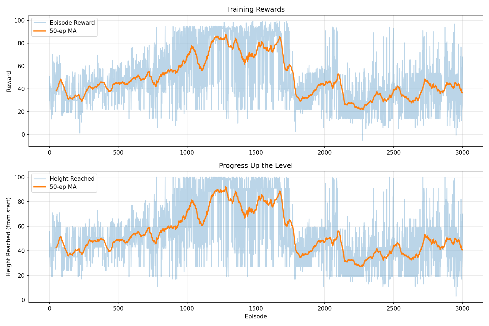

# celeste-rl

Deep reinforcement learning agent that learns to play Celeste Classic. Uses DQN with custom reward shaping built on the Pyleste emulator.



## Results

The agent learned to complete Level 1 (100m) in ~150 training episodes:

| Metric | Value |
|--------|-------|
| Episodes to first completion | ~150 |
| Training episodes | 3,000 |
| Best height reached | 0 (level complete!) |
| Starting height | 96 |

## Project Structure

```
celeste-rl/
├── README.md
├── requirements.txt
├── setup.py                    # Optional: for pip install
│
├── pyleste/                    # Pyleste emulator (submodule or copy)
│   ├── PICO8.py
│   ├── CelesteUtils.py
│   ├── Searcheline.py
│   └── Carts/
│       └── Celeste.py
│
├── src/                        # Your RL code
│   ├── __init__.py
│   ├── environment.py          # CelesteEnv class
│   ├── agent.py                # DQN agent
│   ├── network.py              # Neural network architecture
│   ├── replay_buffer.py        # Experience replay
│   └── train.py                # Training script
│
├── scripts/                    # Utility scripts
│   ├── watch_agent.py          # Visualize trained agent
│   ├── evaluate.py             # Evaluate performance
│   ├── export_tas.py           # Export to TAS format
│   └── diagnose.py             # Debug environment
│
├── configs/                    # Hyperparameter configs
│   └── dqn_config.yaml
│
├── models/                     # Saved model weights
│   ├── .gitkeep
│   └── dqn_best.pt             # (gitignored, but keep .gitkeep)
│
├── docs/                       # Documentation & figures
│   ├── training_curve.png
│   ├── architecture.png
│   └── presentation.pptx
│
├── notebooks/                  # Jupyter notebooks (optional)
│   └── analysis.ipynb
│
└── tests/                      # Unit tests (optional)
    └── test_environment.py
```

## Installation

```bash
# Clone the repository
git clone https://github.com/jmtorr3/celeste-rl.git
cd celeste-rl

# Create virtual environment
python -m venv venv
source venv/bin/activate  # On Windows: venv\Scripts\activate

# Install dependencies
pip install -r requirements.txt
```

## Quick Start

### Train an agent
```bash
python src/train.py
```

### Watch a trained agent play
```bash
python scripts/watch_agent.py --model models/dqn_best.pt
```

### Evaluate performance
```bash
python scripts/evaluate.py --model models/dqn_best.pt --episodes 100
```

## How It Works

### Environment

The agent observes:
- Player position (x, y)
- Player velocity (spd.x, spd.y)
- Grace frames (coyote time)
- Dash availability

And can take 15 actions:
- Nothing, Left, Right
- Jump, Jump+Left, Jump+Right
- Dash in 8 directions

### Reward Function

The key to training success was reward shaping:

```python
reward = 0
if reached_new_height:
    reward += height_gained * 1.0  # Big bonus for progress!
if is_moving:
    reward += 0.01                  # Small exploration bonus
if stuck_too_long:
    reward -= 0.1                   # Penalty for inaction
reward -= 0.01                      # Time penalty
```

### Network Architecture

```
Input (6) → Dense(256) → ReLU → Dense(256) → ReLU → Dense(128) → ReLU → Output (15)
```

## Configuration

Key hyperparameters in `configs/dqn_config.yaml`:

```yaml
learning_rate: 0.0005
gamma: 0.99
epsilon_start: 1.0
epsilon_end: 0.05
epsilon_decay: 0.9995
batch_size: 128
buffer_size: 200000
target_update_freq: 200
```

## References

- [Pyleste](https://github.com/CelesteClassic/Pyleste) - Python Celeste Classic emulator
- [Celeste Classic](https://celesteclassic.github.io/) - Original game
- [DQN Paper](https://arxiv.org/abs/1312.5602) - Playing Atari with Deep RL

## License

MIT License - See LICENSE file

## Project Contributors

- Akhil Madipalli (akhimadi)
- Maryam Malik (maryam23)
- Jorge Manuel Torre (jmt1006)

## Acknowledgments

- Pyleste by the Celeste Classic community
- Original Celeste Classic by Matt Thorson and Noel Berry
